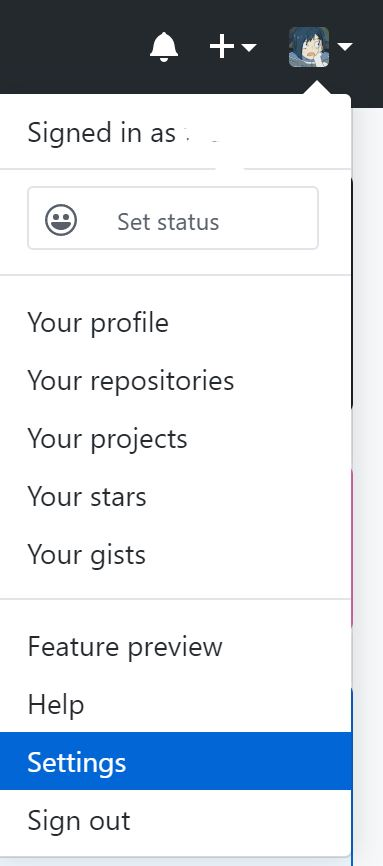

# 创建并连接远程仓库

## 免密码密钥登陆

首先在电脑硬盘上新建一个文件夹作为git仓库的目录，然后在文件夹空白处右击，选择Git Bash Here。我在这里选择的是Onedrive下的文件夹，弹出的窗口显示如下，其中**me@DESKTOP-02FTDM3**为电脑用户名@电脑名称：

```
me@DESKTOP-02FTDM3 MINGW64 ~/OneDrive - email.szu.edu.cn/git
$
```

输入ssh-keygen生成一对公私密钥，为了使用方便，我们可以不给密钥设置单独的密码，直接回车四次：

```bash
$ ssh-keygen
Generating public/private rsa key pair.
Enter file in which to save the key (/c/Users/me/.ssh/id_rsa):
Enter passphrase (empty for no passphrase):
Enter same passphrase again:
Your identification has been saved in /c/Users/me/.ssh/id_rsa.
Your public key has been saved in /c/Users/me/.ssh/id_rsa.pub.
The key fingerprint is:

```

key fingerprint下面可以看到我们生成的SHA256值等信息，接着按上面提示的公钥存放目录将公钥内容显示出来：

```bash
cat ~/.ssh/id_rsa.pub
```

显示内容应如下：

```bash
ssh-rsa ...... me@DESKTOP-02FTDM3
```

将上面这段内容复制，然后在[github主页面](https://github.com/)右上角用户头像下找到settings，在跳转的页面中找到SSH and GPG keys，点击右边的New SSH Key将复制的内容进行粘贴将我们生成的公钥添加到github中。




