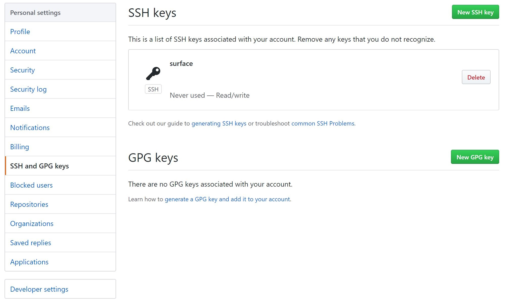

# 创建并连接远程仓库

## 免密码密钥登陆

首先在电脑硬盘上新建一个文件夹作为git仓库的目录，然后在文件夹空白处右击，选择Git Bash Here。我在这里选择的是Onedrive下的文件夹，弹出的窗口显示如下，其中**me@DESKTOP-02FTDM3**为电脑用户名@电脑名称：

```
me@DESKTOP-02FTDM3 MINGW64 ~/OneDrive - email.szu.edu.cn/git
$
```

输入ssh-keygen生成一对公私密钥，为了使用方便，我们可以不给密钥设置单独的密码，直接回车四次：

```bash
$ ssh-keygen
Generating public/private rsa key pair.
Enter file in which to save the key (/c/Users/me/.ssh/id_rsa):
Enter passphrase (empty for no passphrase):
Enter same passphrase again:
Your identification has been saved in /c/Users/me/.ssh/id_rsa.
Your public key has been saved in /c/Users/me/.ssh/id_rsa.pub.
The key fingerprint is:

```

key fingerprint下面可以看到我们生成的SHA256值等信息，接着按上面提示的公钥存放目录将公钥内容在命令行中显示出来：

```bash
cat ~/.ssh/id_rsa.pub
```

显示内容应如下：

```bash
ssh-rsa ...... me@DESKTOP-02FTDM3
```

将上面这段内容复制，然后在[github主页面](https://github.com/)右上角用户头像下找到settings，在跳转的页面中找到SSH and GPG keys，点击右上角的New SSH Key，将复制的内容在Key一栏进行粘贴，Title自行命名（这里我命名为surface），将我们生成的公钥添加到github中。


之所以要将公钥而不是私钥添加到网站中，是因为公钥加密私钥解，私钥签名公钥验，我们是不希望别人冒充我们发信息，因此数字签名是私钥签名公钥验证。





接下来我们要在命令行中输入我们github里的用户名和邮箱，假如要使得在新开命令行的情况下也不需要重复输入，则加入**--global**全局参数：

```bash
$ git config --global user.name "你的用户名"
$ git config --global user.email "你的邮箱"
```

## 创建远程仓库

首先我们要先创建远程仓库，然后将远程仓库克隆至本地文件夹。创建远程仓库有两种方式：

1.在github的右上角+号点击New respository进行新远程仓库的建立，建立仓库的时候可以选择仓库权限公开或者私密。


2.使用**git remote add**命令进行建立，**origin**为后面的https链接参数的short name别称，**user**为你的github用户名，**repo**表示要建立的远程仓库的名称。

```
$ git remote add origin https://github.com/user/repo.git
```

## 克隆本地仓库

使用**git clone**命令将远程仓库克隆到本地的文件夹中，参数意义同上一步一致。当然新建立的远程仓库除了readme之外是没有内容的，我这里演示的时候克隆了一个已经加入了文件的远程仓库。克隆完后进入该文件夹，完成克隆。

```text
$ git clone https://github.com/user/repo.git
Cloning into 'repo'...
remote: Enumerating objects: 9, done.
remote: Counting objects: 100% (9/9), done.
remote: Compressing objects: 100% (5/5), done.
remote: Total 9 (delta 1), reused 8 (delta 0), pack-reused 0
Unpacking objects: 100% (9/9), 628 bytes | 13.00 KiB/s, done.

$ cd repo
```

或者使用ssh方式进行克隆，这种方式不像https协议在远程提交时使用用户名和密码进行临时token的无状态验证，可以使用我们之前的免密码密钥，同步不需要用户名和密码：

```text
$ git clone git@github.com:user/repo.git
```


假如在使用ssh方式克隆时出现了：

`Host key verification failed. fatal: Could not read from remote repository.`

`Please make sure you have the correct access rights and the repository exists.`

这样的错误提示，需要将github.com加入信任的域名中：

`ssh-keyscan -t rsa github.com >> ~/.ssh/known_hosts`


在下一步中我们再进行仓库的CURD（增删改查）操作。

